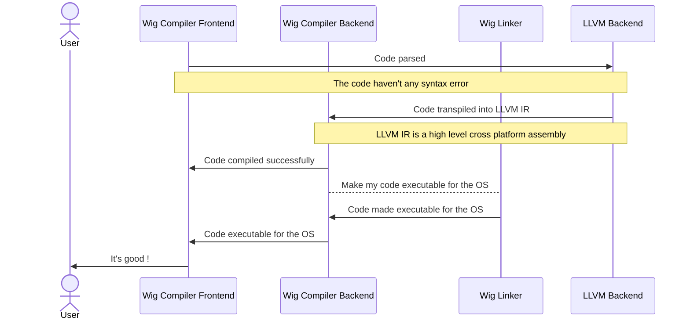

# The Wig Programming Language

> Wig is a general-purpose programming language for creating **robust**, **secure**, **fast** and **efficient** software.

> **Important**
> Wig is still in development and is not ready for production use.

## Table of Contents
- [Introduction](#introduction)
- [Features](#features)
- [Installation](#installation)
- [Usage](#usage)
- [How It Works](#how-it-works)
- [Contributing](#contributing)
- [License](#license)

## Introduction

Wig is a general-purpose programming language for creating **robust**, **secure**, **fast** and **efficient** software.

Wig is a compiled language that compiles to LLVM IR. It is designed to be a middle-level language that is easy to use and understand, while also being fast and efficient.

## Features

- **Robust:** Wig is a statically typed language, which means that the compiler will check for type errors at compile time, so you don't have to worry about runtime errors.
- **Secure:** Wig is a memory-safe language, which means that you don't have to worry about memory leaks or buffer overflows.
- **Fast:** Wig is a compiled language, which means that your code will be compiled to machine code, so it will run as fast as possible. It's aim to compile itself in less than 10 seconds.
- **Efficient:** Wig is a mid-level language, which means that you can write code that is as efficient as C, but as easy to use as Rust.

## Installation


### Building from source

#### Prerequisites

- [Git](https://git-scm.com/)
- [CMake](https://cmake.org/)
- [LLVM](https://llvm.org/)
- [Clang](https://clang.llvm.org/)
- [Ninja](https://ninja-build.org/)

#### Building

```bash
git clone https://github.com/wiglang/wig.git
cd wig
mkdir build
cd build
cmake -G Ninja ..
ninja
```

## Usage

### Compiling a Wig program

```bash
wigc -i=<input file> -o=<output file>
```

### Running a Wig program

```bash
wigc -i=<input file> -o=<output file> --run
```

## How It Works

Wig is a compiled language that compiles to LLVM IR. It is designed to be a middle-level language that is easy to use and understand, while also being fast and efficient.



## Contributing

Contributions are welcome! Please read [CONTRIBUTING.md](CONTRIBUTING.md) for more info.